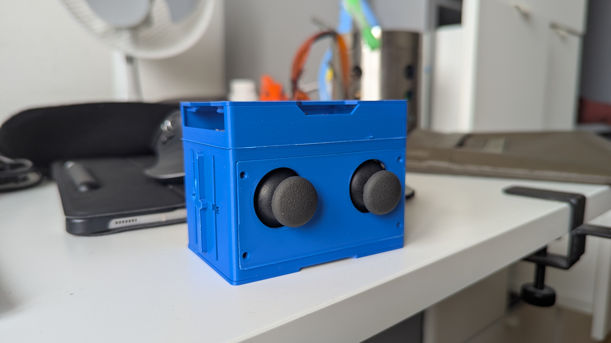
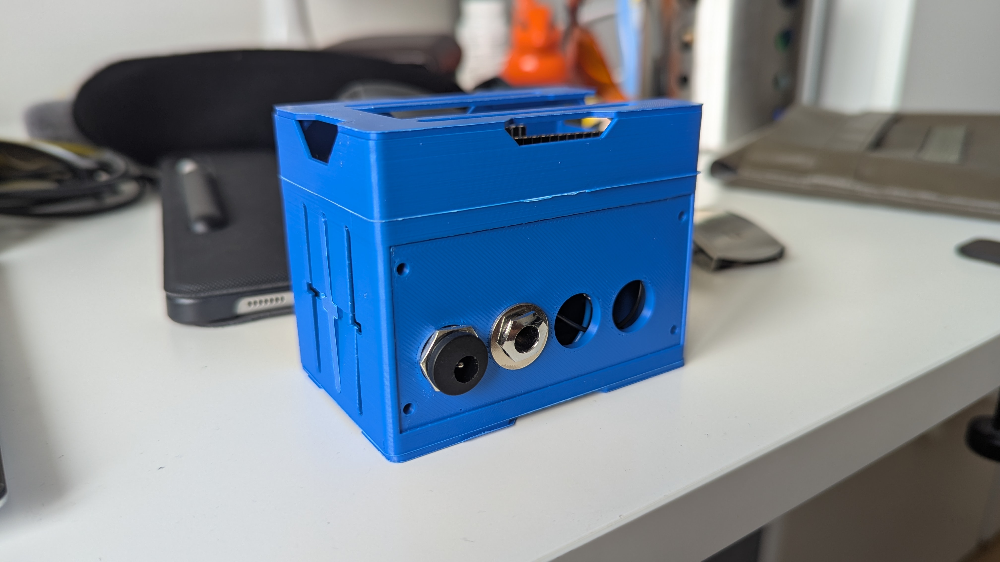

# Description
The issue I'm trying to solve with this device is that controllers such as:
 - JoySticks
 - Pedals
 - Potentiometers

Can be very useful to controle or automate parameters in DAWs (Digital Work Stations) but these parts use analog signals which are unreadable for DAWs. This MIDI Controller currently uses two joysticks and two input ports for pedals and converts them into MIDI CCs.

The difficulty here lies mostly in the design and not the code.

# Ressources
 - Adafruit Feather ESP32-S2 Reverse TFT
 - OnShape
 - Prusa Slicer 
 - 3D Printer

# Images

